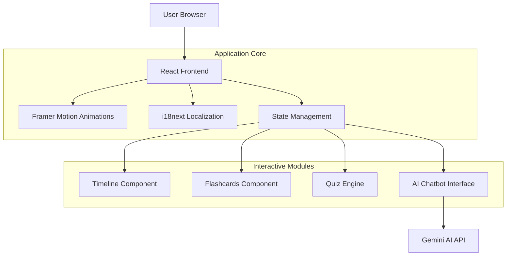
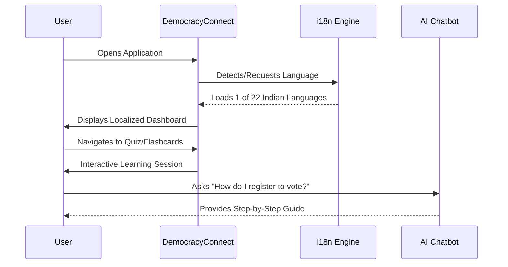

# DemocracyConnect 🇮🇳

**DemocracyConnect** is a premium, interactive web application designed to educate Indian citizens about the election process. Built with a patriotic "Tiranga" (Tricolor) theme, the app provides a seamless and engaging experience across 22 Indian languages.

## 🌟 Key Features

- **🎨 Tiranga-Themed UI**: A modern, vibrant interface inspired by the Indian National Flag, featuring glassmorphism and smooth animations.
- **🗺️ Interactive Election Timeline**: A visual journey through the stages of the Indian election process.
- **🃏 Educational Flashcards**: Quick, interactive cards to learn key election terminology.
- **🧠 Gamified Quizzes**: Test your knowledge about Indian democracy with instant feedback.
- **🤖 AI-Powered Chatbot**: Get real-time answers to your questions about voting, candidates, and election rules.
- **🌍 Multi-Language Support**: Fully internationalized for 22 Indian languages using `i18next`.

## 🏗️ System Architecture



## 🔄 User Flow



## 🛠️ Technology Stack

- **Frontend**: React 18 with Vite
- **Styling**: Vanilla CSS (Premium Glassmorphism Design)
- **Animations**: Framer Motion
- **Internationalization**: i18next & react-i18next
- **Icons**: Lucide React
- **Deployment**: Dockerized (ready for Google Cloud Run)

## 🚀 Getting Started

### Prerequisites
- Node.js (v18+)
- npm or yarn

### Installation
1. Clone the repository:
   ```bash
   git clone https://github.com/sithankumar01/DemocracyConnect.git
   ```
2. Install dependencies:
   ```bash
   npm install
   ```
3. Run the development server:
   ```bash
   npm run dev
   ```

### Docker Setup
To run the application using Docker:
```bash
docker build -t democracy-connect .
docker run -p 8080:80 democracy-connect
```

## 📜 License
This project is licensed under the MIT License - see the [LICENSE](LICENSE) file for details.

---
Built with ❤️ for Indian Democracy.
